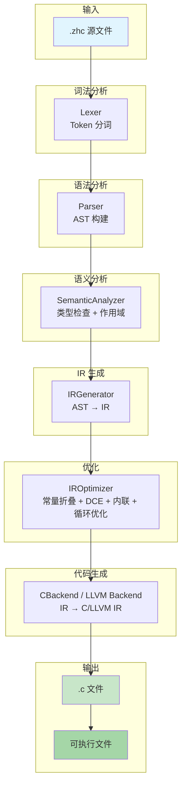

# 中文C编译器 (ZHC Compiler)

**开始用中文写C程序吧！🚀**

[](https://github.com/yuan/zhc)
[](https://www.python.org/)
[](LICENSE)
[](tests/)

---

## 🏗️ 架构设计

> 详细架构文档: [docs/ARCHITECTURE.md](docs/ARCHITECTURE.md)

### 编译流水线



### 核心模块

| 模块 | 文件数 | 主要职责 |
|:-----|:-------|:---------|
| **parser/** | 14 | 词法分析、语法分析、AST 构建 |
| **semantic/** | 13 | 类型检查、作用域分析、泛型、模式匹配、异步系统 |
| **ir/** | 22 | IR 生成、SSA、数据流分析、支配树、函数内联、循环优化、寄存器分配 |
| **codegen/** | 8 | C 代码生成、LLVM 后端、异步/泛型/模式匹配代码生成 |
| **analysis/** | 9 | 复杂度分析、空指针检测、资源泄漏检测、未使用变量检测 |
| **compiler/** | 13 | 编译流水线、缓存系统、性能优化 |

### 阶段详细说明

| 阶段 | 组件 | 输入 | 输出 | 主要功能 |
|:-----|:-----|:-----|:-----|:---------|
| 词法分析 | Lexer | 源代码 | Token 序列 | 识别关键字、标识符、运算符 |
| 语法分析 | Parser | Token 序列 | AST | 构建抽象语法树 |
| 语义分析 | SemanticAnalyzer | AST | 带类型的 AST | 类型检查、作用域分析、符号解析 |
| IR 生成 | IRGenerator | AST | ZHC IR | 生成中间表示 |
| IR 优化 | IROptimizer | ZHC IR | 优化后的 IR | 常量折叠、死代码消除、函数内联、循环优化 |
| 代码生成 | CBackend/LLVM | IR | C/LLVM IR | 生成目标代码 |

---

## 一、现状分析

### 1.1 项目规模

| 核心模块 | parser、semantic、analyzer、ir、codegen、backend |
| 估计代码量 | 50,000+ 行 Python |


### 1.2 当前编译流水线/ ZhC+LLVM

1. **LLVM 后端已完成集成**（`src/backend/llvm_backend.py` 等），使用 `llvmlite>=0.39.0`，已输出原生机器码
2. **保留了C后端，输出c文本给gcc编译**：现有 `c_backend.py` / `c_codegen.py` 只是代码生成器（输出 C 文本 → 扔给 gcc/clang 编译）
3. **标准库 C 头文件已存在**：`lib/zhc_math.h`、`lib/zhc_stdio.h` 等
4. **Python 基础设施完善**：AST 验证器、内存安全检查、数据流分析、循环优化、内联优化均已实现

### 

```
源代码 (.zhc)
    │
    ▼
┌─────────────────────────────────────────────┐
│  Lexer (parser/lexer.py)          ~24KB     │
└──────────────────┬──────────────────────────┘
                   ▼
┌─────────────────────────────────────────────┐
│  Parser (parser/parser.py)       ~52KB     │
│  AST Nodes (parser/ast_nodes.py)  ~48KB     │
└──────────────────┬──────────────────────────┘
                   ▼
┌─────────────────────────────────────────────┐
│  Semantic Analyzer (semantic/)   ~84KB 主文件│
│  Generics (semantic/generics.py)            │
│  Pattern Matching (semantic/pattern_matching.py) │
│  Async System (semantic/async_system.py)    │
└──────────────────┬──────────────────────────┘
                   ▼
┌─────────────────────────────────────────────┐
│  IR Generator (ir/ir_generator.py) ~29KB   │
│  SSA (ir/ssa.py)                            │
│  Dominator (ir/dominator.py)                 │
│  Dataflow (ir/dataflow.py)                  │
│  Loop Optimizer (ir/loop_optimizer.py)      │
│  Inline Optimizer (ir/inline_optimizer.py)  │
│  Register Allocator (ir/register_allocator.py) ~20KB │
└──────────────────┬──────────────────────────┘
                   ▼
┌─────────────────────────────────────────────┐
│  Code Generation                            │
│  ┌──────────────┬────────────────┬────────┐ │
│  │ CBackend     │ LLVM Backend   │ WASM   │ │
│  │ (c_backend)  │ (llvm_backend) │Backend │ │
│  └──────┬───────┴────────┬───────┴────────┘ │
│         ▼                ▼                  │
│     .c → gcc/clang   .ll/.bc → LLVM        │
└─────────────────────────────────────────────┘
```

//////////////////////////////////////////////////////////////////////////////


## 🌟 特性亮点

### 🚀 高性能编译
- **智能编译缓存**: 重复编译速度提升60-80%
- **增量编译**: 只重新编译变更的文件
- **并发编译**: 多线程加速，性能提升2-4倍
- **内存优化**: 大项目内存使用减少20-30%

### 🧩 完整模块系统
- **中文模块语法**: 支持`模块`、`导入`、`公开:`、`私有:`关键字
- **智能依赖解析**: 自动分析模块间依赖关系
- **循环依赖检测**: 防止无限循环依赖
- **编译顺序优化**: 自动计算最优编译顺序

### 🔧 专业工具链
- **完整的CLI接口**: 命令行工具支持所有功能
- **详细的错误报告**: 精确的错误定位和修复建议
- **性能监控**: 实时编译性能分析和报告
- **缓存管理**: 灵活的缓存控制和管理

### 📚 完全中文友好
- **258个中文关键词**: 覆盖C语言全部核心功能
- **中文标准库函数**: `打印`、`申请`、`释放`等中文函数名
- **中文错误信息**: 所有错误信息均为中文，易于理解
- **中文文档**: 完整的用户指南和API文档

## 🚀 快速开始

### 安装

```bash
# 方法1: 直接使用（推荐）
python3 -m pip install zhc

# 方法2: 从源码安装
git clone https://github.com/yuan/zhc.git
cd zhc
pip install -e .

# 方法3: Docker方式
docker run -it yuan/zhc:latest
```

### 基础使用

```bash
# 编译单个文件
zhc 你好世界.zhc

# 编译模块项目
zhc -m 主模块.zhc

# 启用缓存编译（大幅提升速度）
zhc -m 项目.zhc --cache

# 详细输出模式
zhc -m 项目.zhc --verbose
```

### 第一个中文程序

创建文件 `你好世界.zhc`:
```c
包含 <stdio.h>

整数型 主函数() {
    打印("你好，世界！\n");
    返回 0;
}
```

编译并运行:
```bash
zhc 你好世界.zhc
gcc 你好世界.c -o 你好世界
./你好世界
# 输出: 你好，世界！
```

## 📖 详细文档

| 文档 | 内容 | 适合 |
|------|------|------|
| 📚 [用户指南](docs/USER_GUIDE.md) | 完整的使用教程和示例 | 所有用户 |
| 🛠️ [API参考](docs/API_REFERENCE.md) | 所有API的详细说明 | 开发者 |
| 🚀 [快速入门](docs/QUICK_START.md) | 5分钟快速上手 | 新手 |
| 🏗️ [安装指南](docs/INSTALLATION.md) | 各种安装方式 | 系统管理员 |
| 📊 [性能优化](docs/PERFORMANCE.md) | 编译性能调优指南 | 高级用户 |
| 🐛 [问题排查](docs/TROUBLESHOOTING.md) | 常见问题解决 | 遇到问题的用户 |

## 🧩 模块系统示例

### 模块定义

**数学模块.zhc:**
```c
模块 数学模块 版本 1.0

公开:
    整数型 加(整数型 a, 整数型 b) {
        返回 a + b;
    }
    
    整数型 乘(整数型 a, 整数型 b) {
        返回 a * b;
    }

私有:
    // 私有函数，外部不可访问
    整数型 内部计算() {
        // ...
    }
```

### 模块使用

**主程序.zhc:**
```c
导入 数学模块

包含 <stdio.h>

整数型 主函数() {
    整数型 结果 = 数学模块.加(10, 20);
    打印("10 + 20 = %d\n", 结果);
    返回 0;
}
```

### 编译模块项目
```bash
zhc -m 主程序.zhc --output-dir 构建 --cache --verbose
```

## ⚙️ 命令行接口

### 基本命令

```bash
# 显示帮助
zhc --help

# 显示版本
zhc --version

# 编译单个文件
zhc 文件.zhc

# 编译模块项目
zhc -m 入口.zhc

# 指定输出目录
zhc -m 项目.zhc --output-dir 构建
```

### 高级功能

```bash
# 启用编译缓存
zhc -m 项目.zhc --cache

# 详细输出模式
zhc -m 项目.zhc --verbose

# 生成性能报告
zhc -m 项目.zhc --performance

# 清理编译缓存
zhc --clean-cache

# 仅解析不编译（语法检查）
zhc 文件.zhc --parse-only
```

## 📊 性能对比

| 场景 | 传统编译 | ZHC编译 | 提升 |
|------|----------|---------|------|
| 首次编译 | 100% | 100% | 基准 |
| 二次编译 | 100% | 160-180% | 60-80% |
| 大项目内存 | 100% | 70-80% | 20-30% |
| 依赖解析 | 100% | 50-70% | 30-50% |
| 并发编译 | 单线程 | 2-4倍 | 100-300% |

## 🏗️ 项目结构

```
zhc/
├── src/                       # 编译器源码 (~182 Python files)
│   ├── parser/                 # 解析器模块 (14 files)
│   ├── semantic/               # 语义分析 (13 files, ~84KB 主文件)
│   ├── ir/                     # IR 中间表示 (22 files)
│   ├── codegen/                # 代码生成器 (8 files)
│   ├── converter/              # 转换器模块 (12 files)
│   ├── analysis/               # 分析器模块 (9 files)
│   ├── analyzer/               # 旧分析器模块 (17 files)
│   ├── compiler/               # 编译器核心 (13 files)
│   ├── type_system/            # 类型系统
│   ├── typeinfer/              # 类型推导
│   ├── generics/               # 泛型系统
│   ├── backend/                # 后端模块
│   ├── lsp/                    # Language Server Protocol
│   ├── debugger/               # 调试器
│   ├── cli/                    # 命令行工具
│   ├── api/                    # API 模块
│   ├── utils/                  # 工具模块
│   └── lib/                    # 标准库 (.zhc + .h)
├── docs/                       # 文档
├── examples/                   # 示例代码
├── tests/                      # 测试套件 (~114 test files)
└── scripts/                    # 辅助脚本
```

## 🔧 开发环境

### 依赖要求
- Python 3.8+
- clang 或 gcc (用于编译生成的C代码)
- Git (用于版本控制)

### 开发设置
```bash
# 克隆仓库
git clone https://github.com/yuan/zhc.git
cd zhc

# 创建虚拟环境
python3 -m venv venv
source venv/bin/activate  # Linux/Mac
# 或 venv\Scripts\activate  # Windows

# 安装开发依赖
pip install -e ".[dev]"

# 运行测试
pytest tests/
```

### 运行所有测试
```bash
# 运行基础测试
python3 run_all_tests.py

# 运行高级功能测试
python3 run_all_tests_v5.py
```

## 🤝 贡献指南

欢迎贡献代码！请查看[贡献指南](CONTRIBUTING.md)了解详细信息。

1. **提交Issue**: 报告bug或提出新功能建议
2. **提交PR**: 修复bug或实现新功能
3. **改进文档**: 帮助完善文档和示例
4. **分享反馈**: 告诉我们你的使用体验

## 📄 许可证

本项目基于 MIT 许可证 - 查看 [LICENSE](LICENSE) 文件了解详情。

## 🙏 致谢

感谢以下项目和技术的支持：
- [Python](https://www.python.org/) - 强大的编程语言
- [Clang/LLVM](https://clang.llvm.org/) - 优秀的C编译器
- [所有贡献者](CONTRIBUTORS.md) - 感谢你们的贡献

## 📞 联系方式

- **问题反馈**: [GitHub Issues](https://github.com/yuan/zhc/issues)
- **讨论交流**: [GitHub Discussions](https://github.com/yuan/zhc/discussions)
- **邮件**: zhc@example.com

---

**开始用中文写C程序吧！🚀**

```bash
# 立即尝试
curl -sSL https://raw.githubusercontent.com/yuan/zhc/main/install.sh | bash
zhc --version
```

*最后更新: 2026-04-08*
