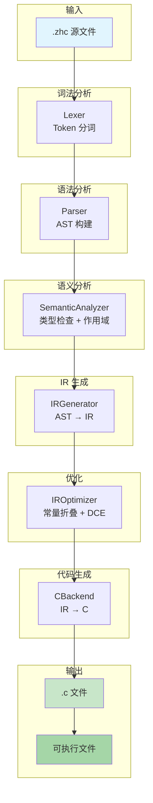
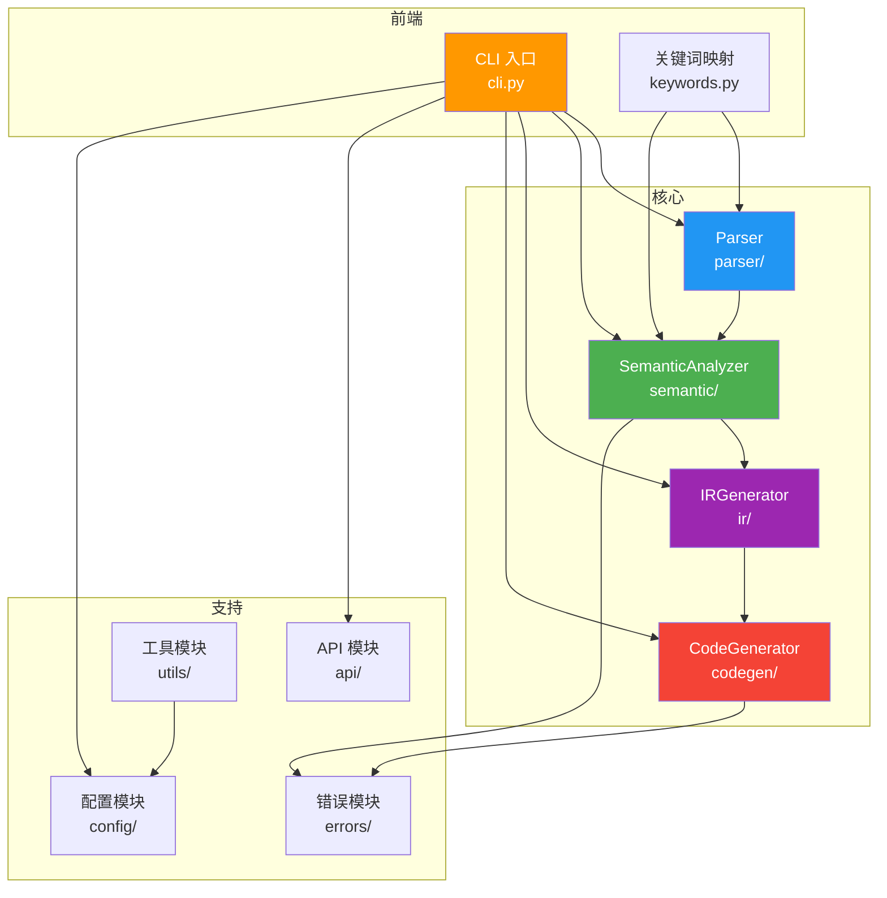
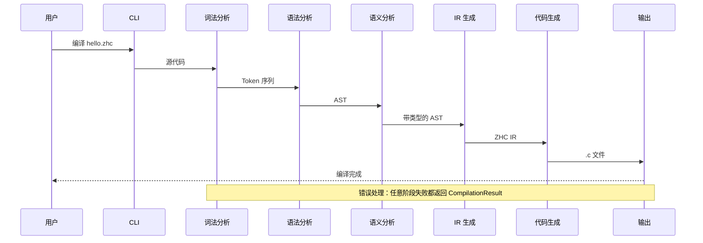
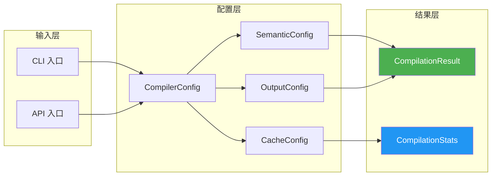

# ZHC 编译器架构设计文档

**版本**: v6.0  
**更新日期**: 2026-04-08  
**架构师**: 远

---

## 编译流水线架构图



### 阶段详细说明

| 阶段 | 组件 | 输入 | 输出 | 主要功能 |
|:-----|:-----|:-----|:-----|:---------|
| 词法分析 | Lexer | 源代码 | Token 序列 | 识别关键字、标识符、运算符 |
| 语法分析 | Parser | Token 序列 | AST | 构建抽象语法树 |
| 语义分析 | SemanticAnalyzer | AST | 带类型的 AST | 类型检查、作用域分析、符号解析 |
| IR 生成 | IRGenerator | AST | ZHC IR | 生成中间表示 |
| 优化 | IROptimizer | ZHC IR | 优化后的 IR | 常量折叠、死代码消除 |
| 代码生成 | CBackend | IR | C 代码 | 生成目标代码 |

---

## 一、架构概述

ZHC（中文C编译器）采用模块化架构设计，将编译过程分解为多个独立的子模块，每个模块负责特定的功能领域。

### 设计原则

1. **单一职责**：每个子模块只负责一个明确的功能领域
2. **松耦合**：模块间通过明确的接口通信，降低依赖关系
3. **高内聚**：相关功能集中在一个模块内
4. **可扩展**：易于添加新功能或替换现有实现
5. **可测试**：每个模块都可以独立测试

---

## 二、目录结构

```
src/
├── __init__.py              # 包入口，导出公共API
├── __main__.py              # CLI入口点
├── cli.py                   # 主命令行接口
├── keywords.py              # 中文关键词映射表
│
├── parser/                  # 解析器模块
│   ├── module.py           # 模块语法解析
│   ├── class_.py           # 类语法解析
│   ├── class_extended.py   # 扩展类解析器
│   ├── memory.py           # 内存语法解析
│   ├── scope.py            # 作用域管理
│   └── smart_pointer.py    # 智能指针解析
│
├── converter/               # 转换器模块
│   ├── code.py             # 代码转换器
│   ├── error.py            # 错误处理器
│   ├── integrated.py       # 集成转换器
│   ├── attribute.py        # 属性转换器
│   ├── method.py           # 方法转换器
│   ├── inheritance.py      # 继承转换器
│   ├── virtual.py          # 虚函数转换器
│   ├── operator.py         # 运算符重载
│   └── memory.py           # 内存语法转换器
│
├── analyzer/                # 分析器模块
│   ├── dependency.py       # 依赖关系分析
│   ├── performance.py      # 性能分析器
│   └── memory_safety.py    # 内存安全分析
│
├── compiler/                # 编译器模块
│   ├── pipeline.py         # 编译流水线
│   ├── cache.py            # 缓存系统
│   └── optimizer.py        # 性能优化器
│
├── types/                   # 类型系统
│   └── smart_ptr.py        # 智能指针实现
│
├── cli/                     # 命令行子模块
│   ├── main.py             # 主命令处理
│   └── toolchain.py        # 工具链管理
│
└── lib/                     # 标准库
    ├── __init__.py
    ├── stdio.c             # 标准输入输出库
    └── zhc_stdio.h         # 头文件
```

---

## 三、核心模块详解

### 3.1 解析器模块 (parser/)

**职责**：将中文C源码解析为内部数据结构

#### 关键类

| 类名 | 文件 | 职责 |
|:---|:---|:---|
| ModuleParser | module.py | 解析模块声明、导入语句、可见性控制 |
| ClassParser | class_.py | 解析类声明、属性、方法 |
| ClassParserExtended | class_extended.py | 扩展类解析，支持继承、多态 |
| MemoryParser | memory.py | 解析内存管理语法（申请、释放等） |
| ScopeManager | scope.py | 管理符号作用域和可见性 |

#### 数据流
```
中文源码 → 词法分析 → 语法分析 → AST/中间表示
```

---

### 3.2 转换器模块 (converter/)

**职责**：将解析后的中文语法转换为标准C代码

#### 关键类

| 类名 | 文件 | 职责 |
|:---|:---|:---|
| CodeConverter | code.py | 通用代码转换器 |
| AttributeConverter | attribute.py | 类属性转换（中文类型→C类型） |
| MethodConverter | method.py | 方法转换（this指针、函数签名） |
| InheritanceConverter | inheritance.py | 继承关系转换（struct嵌套） |
| VirtualMethodTableGenerator | method.py | 虚函数表生成 |
| ErrorHandler | error.py | 错误收集、分类、报告 |

#### 转换规则

**类到struct映射**：
```python
中文语法                      →  C代码
─────────────────────────────────────────
类 学生 {                    →  typedef struct 学生_t {
    整数型 年龄;              →      int 年龄;
    字符串型 姓名;            →      char* 姓名;
}                            →  } 学生;
```

**方法转换规则**：
```python
中文方法                      →  C函数
─────────────────────────────────────────
函数 获取信息() -> 字符串型   →  char* 学生_获取信息(struct 学生* self)
静态 函数 计数() -> 整数型    →  int 学生_计数()  # 无this指针
虚函数 绘制() -> 空型         →  void 绘制(struct 形状* self)
```

---

### 3.3 分析器模块 (analyzer/)

**职责**：分析代码质量、依赖关系、性能特征

#### 关键类

| 类名 | 文件 | 职责 |
|:---|:---|:---|
| DependencyResolver | dependency.py | 模块依赖解析、循环检测、拓扑排序 |
| PerformanceAnalyzer | performance.py | 性能测量、基准测试、优化建议 |
| MemorySafetyAnalyzer | memory_safety.py | 内存泄漏检测、越界检查 |

#### 依赖解析算法

使用Kahn算法进行拓扑排序，确保编译顺序正确：
```python
1. 构建依赖图（有向无环图）
2. 检测循环依赖（DFS算法）
3. 拓扑排序（Kahn算法）
4. 生成编译顺序
```

---

### 3.4 编译器模块 (compiler/)

**职责**：协调各模块完成完整的编译流程

#### 关键类

| 类名 | 文件 | 职责 |
|:---|:---|:---|
| IntegrationPipeline | pipeline.py | 完整编译流水线 |
| CompileCache | cache.py | 基于内容哈希的缓存系统 |
| PerformanceOptimizer | optimizer.py | 编译性能优化 |

#### 编译流程

```
源文件 (.zhc)
    ↓
[模块解析] ModuleParser.parse_file()
    ↓
[依赖分析] DependencyResolver.resolve()
    ↓
[代码转换] CodeConverter.convert()
    ↓
[代码生成] 生成 .h 和 .c 文件
    ↓
[C编译] clang/gcc 编译为可执行文件
```

---

### 3.5 类型系统 (types/)

**职责**：实现高级类型系统特性

#### 智能指针

```python
中文语法:
    智能指针<整数型> ptr = 申请智能<整数型>(42);
    
C代码:
    int* ptr = malloc(sizeof(int));
    *ptr = 42;
    // 自动添加析构逻辑
### 3.5 IR 中间表示 (ir/)

**职责**：Phase 7 新增的 IR 层，为代码优化提供中间表示基础。

```
src/ir/
├── symbol.py         # 统一 Symbol + Scope + SymbolCategory
├── types.py          # ZHCTy = TypeInfo 别名
├── opcodes.py        # 35+ 操作码（算术/比较/位运算/内存/控制流/转换）
├── values.py         # IRValue, ValueKind
├── instructions.py   # IRInstruction, IRBasicBlock
├── program.py       # IRProgram, IRFunction, IRGlobalVar, IRStructDef
├── printer.py        # IRPrinter
├── ir_generator.py   # AST → IR 生成器（42 个 visit 方法）
├── c_backend.py     # IR → C 后端（基本块展平算法）
├── ir_verifier.py    # 7 项 IR 合法性检查
├── optimizer.py      # ConstantFolding + DeadCodeElimination + PassManager
└── mappings.py      # TYPE_MAP / FUNCTION_NAME_MAP 等（从 codegen/c_codegen.py 提取）
```

#### 编译流程（Phase 7）

```
.zhc 源码 → Lexer → Parser → AST
                           ↓
                  SemanticAnalyzer（AST 分析）
                           ↓
                     IRGenerator（AST → IR）
                           ↓
                        ZHC IR
                           ↓
                      IRVerifier（7 项检查）
                           ↓
                    Optimizer（常量折叠/死代码消除）
                           ↓
                        IR'
                           ↓
                       CBackend（IR → C）
                           ↓
                        C 代码 → clang → 可执行文件
```

#### CLI 参数（Phase 7）

| 参数 | 默认 | 说明 |
|------|------|------|
| `--backend ir\|ast` | ast | 选择后端 |
| `--dump-ir` | 关闭 | 打印 IR |
| `--no-optimize` | 关闭 | 禁用优化 Pass |

---

### 3.6 命令行模块 (cli/)

**职责**：提供用户友好的命令行接口

#### 主要命令

```bash
# 编译单文件
python3 -m src.__main__ hello.zhc

# 编译项目
python3 -m src.__main__ build project/

# 清理缓存
python3 -m src.__main__ clean --cache

# 性能分析
python3 -m src.__main__ profile input.zhc

# 生成文档
python3 -m src.__main__ doc api/
```

---

## 四、数据流与依赖关系

### 4.1 模块依赖关系图



### 4.2 编译数据流



### 4.3 API 数据流



---

## 五、扩展指南

### 5.1 添加新的解析器

1. 在 `parser/` 目录下创建新文件
2. 实现解析器类，继承基础解析器接口
3. 在 `__init__.py` 中导出新类
4. 编写单元测试（tests/test_suite*/）

**示例**：
```python
# parser/new_feature.py
from zhc.parser.base import BaseParser

class NewFeatureParser(BaseParser):
    def parse(self, source: str) -> ASTNode:
        # 实现解析逻辑
        pass
```

### 5.2 添加新的转换器

1. 在 `converter/` 目录下创建新文件
2. 实现转换器类，包含中文→C的映射逻辑
3. 注册到集成转换器
4. 添加单元测试

### 5.3 添加新的分析器

1. 在 `analyzer/` 目录下创建新文件
2. 实现分析逻辑
3. 集成到编译流水线
4. 添加性能测试

---

## 六、性能优化策略

### 6.1 编译缓存

**缓存键**: 文件内容哈希 + 依赖哈希  
**缓存内容**: 转换后的C代码  
**命中率**: 60-80%（增量编译）

### 6.2 并发编译

**策略**: 独立模块并行编译  
**加速比**: 2-4倍（多核CPU）  
**依赖**: 拓扑排序确保正确性

### 6.3 内存优化

**对象池**: 复用AST节点  
**延迟加载**: 按需解析模块  
**内存映射**: 大文件使用mmap

---

## 七、测试策略

### 7.1 测试套件组织

```
tests/
├── conftest.py              # pytest配置
├── test_suite1_types.py     # 类型系统测试
├── test_suite2_control.py   # 流程控制测试
├── test_suite3_funcs.py     # 函数测试
├── test_suite8/             # 类系统完整测试
│   ├── test_class_system_complete.py
│   ├── test_module_conversion.py
│   └── ...
└── test_suite10/            # 高级特性测试
```

### 7.2 测试覆盖率

- **单元测试**: 95%+代码覆盖
- **集成测试**: 关键路径100%覆盖
- **性能测试**: 基准测试套件

---

## 八、未来规划

### Phase 4 (计划中)

1. **类型推导系统**
   - 自动类型推导
   - 泛型支持

2. **元编程支持**
   - 编译时计算
   - 代码生成

3. **跨平台支持**
   - Windows/Linux/macOS
   - 嵌入式平台

4. **IDE集成**
   - VSCode插件
   - 语法高亮
   - 代码补全

---

## 九、附录

### A. 中文关键词完整列表

参见 `src/keywords.py`，共258个关键词。

### B. API参考文档

- 在线文档: https://zhc.readthedocs.io
- 本地生成: `python3 -m src.__main__ doc api/`

### C. 贡献指南

参见 `CONTRIBUTING.md`

---

**文档维护者**: 远  
**最后更新**: 2026-04-08

---

## 十、Phase 1-5 架构演进记录

### Phase 1: 项目初始化
- **时间**: 2026-03
- **主要变化**:
  - 创建基础项目结构
  - 实现词法分析器 (Lexer)
  - 实现基础语法分析器 (Parser)

### Phase 2: 类系统支持
- **时间**: 2026-03
- **主要变化**:
  - 添加类语法解析 (`parser/class_.py`)
  - 实现继承转换 (`converter/inheritance.py`)
  - 添加虚函数支持 (`converter/virtual.py`)
  - 添加运算符重载 (`converter/operator.py`)

### Phase 3: 模块系统
- **时间**: 2026-03
- **主要变化**:
  - 实现模块解析 (`parser/module.py`)
  - 实现导入/导出机制
  - 添加作用域管理 (`parser/scope.py`)
  - 实现依赖解析 (`analyzer/dependency.py`)

### Phase 4: 内存安全增强
- **时间**: 2026-03
- **主要变化**:
  - 添加内存语法解析 (`parser/memory.py`)
  - 实现内存安全分析 (`analyzer/memory_safety.py`)
  - 添加智能指针支持 (`types/smart_ptr.py`)
  - 实现内存转换 (`converter/memory.py`)

### Phase 5: 重构与优化
- **时间**: 2026-04-07 ~ 2026-04-08
- **主要变化**:
  - 创建统一 API 模块 (`src/api/`)
  - 重构配置系统 (Configuration Groups 模式)
  - 引入 Dispatch Table 模式
  - 优化圈复杂度 (9.5 → 8.0)
  - 质量评分提升 (65 → 70)
  - **新增模块**:
    - `src/api/` - API 模块 (CompilationResult, CompilationStats)
    - `src/utils/` - 工具模块 (file_utils, string_utils, error_utils)

### Phase 6: 文档体系（进行中）
- **时间**: 2026-04-08
- **主要变化**:
  - 配置 Sphinx 文档系统
  - 创建 API 参考文档
  - 编写开发者指南
  - 完善架构文档

### Phase 7: DevOps 流程（计划中）
- **时间**: 2026-04-08 之后
- **计划变化**:
  - 增强 CI/CD 流程
  - 添加 Issue/PR 模板
  - 实现自动化发布
  - 添加 CHANGELOG 自动生成